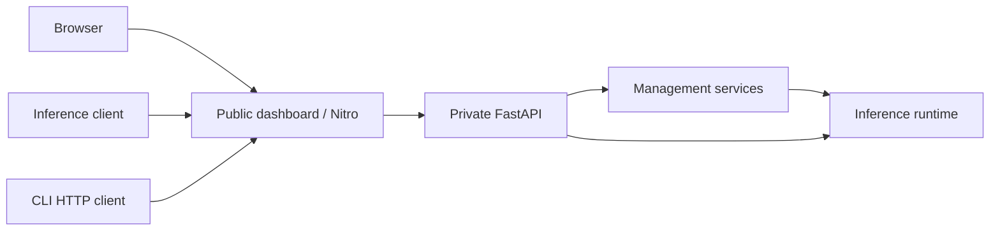

# Repository architecture

An installed `molto` command starts one application: a public TanStack Start/Nitro
server and a private FastAPI inference server. A browser, inference client, and
management CLI all connect to the same public origin. The Python and TypeScript
workspaces organize development; the release assembler ships their required
code and assets together in one wheel.

The dashboard also owns the [model studio](studio.md): its TypeScript agent loop,
server web tools, browser worker sandbox, and browser persistence. The agent
accesses inference only through the model API and has no Python runtime imports.

## Ownership

The uv workspace has six Python members. Python projects use `src/` layouts and
own their unit tests. The pnpm workspace includes the dashboard and generated
TypeScript contracts.

| Path                   | Python import / role                   | Responsibility                                                                                                         |
| ---------------------- | -------------------------------------- | ---------------------------------------------------------------------------------------------------------------------- |
| `apps/cli/`            | `molto_cli`                            | Commands, terminal output, management HTTP client, and local process supervisor                                        |
| `apps/server/`         | `molto_server`                         | FastAPI composition, authentication, HTTP routes, and inference protocol translation                                   |
| `apps/dashboard/`      | TypeScript application                 | Management UI, browser sessions, and public Nitro proxy                                                                |
| `packages/config/`     | `molto_config`                         | Persisted global/model configuration, validation, precedence, and migrations                                           |
| `packages/contracts/`  | `molto_contracts` / `@molto/contracts` | Wire schemas, exported OpenAPI, and generated TypeScript types                                                         |
| `packages/management/` | `molto_management`                     | Model/storage operations, acquisition jobs, keys, diagnostics, and management policy                                   |
| `packages/runtime/`    | `molto_runtime`                        | Engine pool, scheduling, model loading, inference, resource admission, native kernels, and model compatibility patches |
| `tests/integration/`   | Cross-package tests                    | Behavior spanning application or library boundaries                                                                    |
| `tooling/`             | Developer tooling                      | Dependency checks, schema generation, scripts, and release assembly                                                    |

There is no separate Python API-client workspace member. The CLI owns its HTTP
transport because it has one consumer; connection parsing and terminal output
remain separate modules within that application. Dashboard components likewise
stay inside the dashboard.

## Dependency direction

Workspace Python imports must follow this graph. Third-party dependencies are
declared in each member's `pyproject.toml`.

| Consumer   | Allowed internal dependencies          |
| ---------- | -------------------------------------- |
| Config     | None                                   |
| Contracts  | None                                   |
| Runtime    | Config, contracts                      |
| Management | Config, contracts, runtime             |
| Server     | Config, contracts, management, runtime |
| CLI        | Config, contracts, runtime, server     |

`tooling/check_boundaries.py`, included in `pnpm check`, checks internal imports
against allowed and declared dependencies. Config and contracts remain usable
without importing inference libraries or applications. Runtime owns conversion
from persisted settings into scheduler configuration. Libraries cannot import
application code, and runtime cannot depend on FastAPI route handlers or CLI
modules.

Management reads and mutates runtime through its public management interface,
including registry snapshots, resource accounting, load/unload actions, and
operation gates. It does not manipulate engine-pool private dictionaries.
Configuration state has public snapshot/restore methods for operations that
need rollback; the management mutation gate serializes the complete operation.
Snapshots are deep copies, and persistent restoration uses the configuration
manager's atomic file writers.

Server composition creates an application instance with its own state and
controller. Routes resolve that instance through the request. Model scheduling
and execution remain in runtime; the server translates requests and responses.
This permits multiple independent FastAPI applications in tests without a
shared server singleton.

## Request and lifecycle boundaries



Nitro forwards inference, health, streaming responses, and supported WebSockets
to the private loopback listener. Browser management uses `/api/molto` with an
opaque session cookie. Native management clients use `/api/management/v1` with
the main bearer key. Raw `/management/v1` and `/admin` paths stay private.
Authentication and management policy remain authoritative in Python.

The CLI supervisor owns local startup and shutdown. A backend restart can keep
the dashboard alive; changing the effective public bind requires both processes
to restart. Saved settings, environment variables, and explicit CLI overrides
retain their precedence. See the [CLI guide](cli.md) and
[management API](management-api.md) for operating behavior.

## Source development

From the repository root:

```sh
uv sync --all-packages --inexact
pnpm install --frozen-lockfile
pnpm check
pnpm test
pnpm build
```

`uv.lock` resolves Python members together, and root `pnpm-lock.yaml` resolves
JavaScript dependencies. Root `pyproject.toml` owns Ruff and pytest
configuration. Root Oxlint/Oxfmt configuration owns TypeScript lint and format
policy. Type-aware lint uses `oxlint-tsgolint`; `@typescript/native` is the
TypeScript 7 alias used by the root typecheck command. Python typechecking targets the maintained authentication, management contract/routes/service, and native build modules; the legacy runtime is not fully typed. A task cache is not required for these commands.

The root commands perform these jobs:

- `pnpm check`: import boundaries, Ruff, type-aware Oxlint, Oxfmt, native TypeScript checking, and the maintained Python interface/build typecheck.
- `pnpm test`: Python tests and dashboard proxy/browser tests.
- `pnpm build`: dashboard/runtime staging and the single release wheel.
- `pnpm build:dashboard`: only the production dashboard assets.
- `pnpm generate:contracts`: exported Python schemas and generated TypeScript contract types.

For interactive development:

```sh
uv run --all-packages --inexact molto serve --dashboard-dev --model-dir ~/models
```

Unit tests live in `apps/<app>/tests/` or `packages/<package>/tests/`. The default
pytest configuration excludes tests marked `slow` or `integration`; those need
explicit selection and the prerequisites described by their owning tests.
Opt-in model and performance scripts live in `tooling/scripts/`. They can load
models, allocate device memory, or write output, so running ordinary checks does
not run those scripts.

## Release boundary

`tooling/release/build.py` stages the Python workspace source into one `molto`
distribution. `tooling/release/build_dashboard_bundle.py` builds Nitro and stages
public assets plus the verified macOS ARM64 Node executable and license under
`apps/cli/src/molto_cli/_dashboard/`. That generated bundle is ignored in Git.
The native kernel build belongs to `packages/runtime/setup.py`.

Release assembly requires Node/pnpm and may download the chosen Node archive.
The installed wheel needs neither a source checkout nor pnpm. Internal package
names support development boundaries; users install one application with one
product version and invoke one `molto` command.
