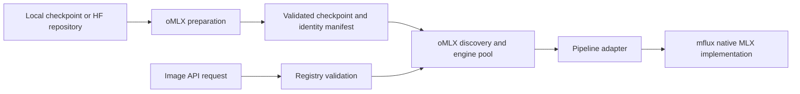

# Image models

Install the optional `image` extra to use mflux 0.20.0 on Apple Silicon. Image
diffusion has its own checkpoint and pipeline registry. DiffusionGemma continues
to use MLX-VLM for text generation; DFlash remains a speculative text drafter.

oMLX owns acquisition, checkpoint discovery, request validation, engine leases,
memory admission, residency, and cleanup. The mflux adapter selects native model
classes and translates validated tasks. A checkpoint identifies weights; a
pipeline identifies an operation on those weights. For example, one
`flux2-klein-4b` checkpoint provides separate generation, image-to-image, and
reference-edit pipelines. Family selection does not live in HTTP handlers.



## Prepare a checkpoint

The retained `mflux-save` command now selects its implementation from the
registry. It acquires required component/tokenizer files, converts weights, and
optionally quantizes with mflux's component and layer policies. This is not
uniform quantization of every tensor. Supported requested levels are 3, 4, 5,
6, and 8 bits where the pipeline permits them.

```bash
omlx mflux-save --model flux2-klein-4b --quantize 4 \
  --output /path/to/models/flux2-klein-4b-q4
```

For an already quantized third-party repository, specify its identity and
preserve its stored precision:

```bash
omlx mflux-save --model mflux-community/flux2-klein-4b-mflux-q4 \
  --base-model flux2-klein-4b --no-quantize \
  --revision 794cd159538149ad9830848508c31f0ea7088e58 \
  --output /path/to/models/flux2-klein-4b-q4
```

`--model` also accepts a local source directory. `--base-model` resolves
ambiguous sources; `--pipeline` chooses the saved default operation. A
conflicting quantization request fails rather than being ignored. Output must
be absent or empty. Conversion saves into a hidden staging directory, validates
it, and publishes the complete directory. Failure removes staging and retains
the source and preexisting output.

The version 2 `omlx-mflux.json` records base identity, default pipeline,
components, actual stored quantization, requested quantization, and source
provenance. Historic version 1 Z-Image Turbo manifests remain readable. Original
checkpoints need unambiguous identity and complete components/tokenizers.
Incomplete or unknown image artifacts are excluded from serving, including
when they contain a root `config.json` that might otherwise resemble a text
model. Stored precision is read from weight metadata, not folder bit labels.

Serving loads local files. It does not acquire absent auxiliary models on
demand. The management API reports checkpoint-specific `diffusion` metadata
and supports the usual load/unload controls. Preparation remains a CLI operation.

## Calibrate and quantize offline

The experimental `diffusion-calibrate` and `diffusion-quantize` commands accept
complete local FLUX.2 Klein 4B or Qwen-Image-2.1 checkpoint directories. They
reject repository names and missing local assets. They use the optional image
runtime and do not download weights. Other families continue to use the native
`mflux-save` quantization path above.

First collect transformer input activation energy with text-to-image prompts:

```bash
omlx diffusion-calibrate --model /path/to/local/flux2-klein-4b \
  --prompt "A red ceramic teapot on a wooden table" \
  --prompt "A blue ceramic bowl on a stone countertop" \
  --steps 4 --width 256 --height 256 --max-rows 64 \
  --output /path/to/calibration.json
```

Calibration accepts floating-point or already quantized checkpoints. It uses
eager native prediction, samples at most `--max-rows` input rows per linear
observation, and accumulates channelwise mean-square energy over every
transformer forward. CFG branches count as separate forwards. The JSON records
layer shapes, observation counts, forward coverage, prompts, resolved native
arguments, source precision, output pixel hashes, and runtime versions. The
source fingerprint covers weight headers and file sizes, not weight contents.
Defaults are 256x256, 256 sampled rows, seed 17, and the pipeline's step count.
Repeating `--prompt` increments the seed. Output must be a new file outside
the source directory; rerunning requires another output filename.

Then quantize from a complete floating-point checkpoint of the same base model:

```bash
omlx diffusion-quantize --model /path/to/local/flux2-klein-4b-float \
  --calibration /path/to/calibration.json --bits 4 --budget-ratio 1.10 \
  --output /path/to/models/flux2-klein-4b-calibrated
```

Fresh quantization rejects packed checkpoints. A calibration report collected
from a quantized proxy can be applied to a matching floating-point source, but
its activations reflect that proxy's precision. Every eligible layer needs
matching shapes and finite, nonzero input energy. Missing coverage fails rather
than falling back to uncalibrated quantization. This path requires the runtime's
complete native component layout; standalone GGUF and single-file MLX exports
are not imported by these commands.

The transformer quantizer shares oQe's activation-weighted affine clipping and
packing implementation. It measures diagonal input-energy-weighted weight
reconstruction error at candidate precisions, then greedily allocates upgrades
by error reduction per added byte. It does not reuse the text model's layer
rules or calibration execution. Supported base levels are 3, 4, 5, 6, and 8;
candidate upgrades use those same levels. Group sizes are 32, 64, and 128, with
64 as the default. `--protect` accepts repeatable transformer-relative linear
module globs; unmatched globs fail. Layers with incompatible group widths remain
floating-point, as do non-linear parameters, the text encoder, and the VAE.

The default byte ceiling is 1.10 times the base-bit transformer allocation.
`--budget-bytes` selects an absolute ceiling instead. Both budgets include
retained floating-point transformer parameters and affine scales/biases; they
exclude other components, file headers, and inference memory. An insufficient
budget fails before module replacement. Preparation also applies a conservative
checkpoint-size admission check against available system and Metal memory.

Saving uses mflux's native saver and an isolated staging directory. The output
must be new or empty and separate from the source. Failure removes staging and
preserves source files. `diffusion-quantization.json` records actual per-layer
precision, byte counts, proxy errors, calibration provenance, and retained layers.
The manifest's nominal integer level enables native mixed-precision reload; it
does not assert uniform precision or effective bits per weight.

Small generated-weight MLX tests verify numerical packing, byte budgets,
protected layers, and an exact native mflux disk round-trip for mixed precision.
Workflow tests use miniature modules and fake pipelines to verify publication
and component preservation. A real offline FLUX.2 q4 calibration run observed
all 109 transformer linear layers on all eight forwards from two four-step
256x256 generations. The
[calibration verification summary](verification/diffusion-quantization-2026-09-30.json)
records those results. This small workload proves collection, not representative
calibration or image-quality improvement. Full-model fresh quantization and
Qwen-Image-2.1 calibration/generation remain unverified.

## Operations and coverage

The registry describes the following checkpoint identities against the installed
mflux 0.20 API. This table describes integration coverage; it does not assert
that every checkpoint has passed real generation. The live registry lists exact options,
defaults, required images, masks, and preparation limitations:

```bash
curl "$OMLX_URL/v1/images/capabilities"
curl "$OMLX_URL/v1/images/capabilities?model=your-model-id"
```

| Canonical checkpoint identities | Operations exposed | Preparation limits |
| --- | --- | --- |
| `dev`, `schnell`, `krea-dev` | Text-to-image, image-to-image | Complete FLUX.1 component layout |
| `dev-kontext` | Reference editing | One reference image |
| `dev-fill` | Inpainting | Image and mask required |
| `dev-fill-catvton` | Listed with unavailable status | Two-image virtual try-on, output cropping, and custom transformer acquisition are not integrated |
| `dev-depth` | Listed with unavailable status | mflux unconditionally initializes external DepthPro weights; no local-only adapter yet |
| `dev-redux` | Reference conditioning | Complete local image encoder/embedder; automatic multi-repository acquisition unavailable |
| `dev-controlnet-canny`, `schnell-controlnet-canny`, `dev-controlnet-upscaler` | Control conditioning | Complete local ControlNet; automatic auxiliary acquisition unavailable |
| `flux2-klein-4b`, `flux2-klein-9b`, `flux2-klein-9b-kv`, `flux2-klein-base-4b`, `flux2-klein-base-9b` | Text-to-image, image-to-image, reference editing | KV editing option only for `9b-kv` |
| `qwen-image` | Text-to-image, image-to-image | Canonical alias targets Qwen-Image-2512 |
| `qwen-image-edit` | Reference editing | Up to three references |
| `qwen-image-2.1` | Text-to-image, image-to-image | No instruction-edit operation; CFG guidance needs a nonempty negative prompt |
| `fibo`, `fibo-lite` | Text-to-image, image-to-image | JSON scene prompt; automatic VLM prompt expansion unavailable |
| `fibo-edit`, `fibo-edit-rmbg` | Reference editing, optional mask | JSON prompt with `edit_instruction` |
| `z-image`, `z-image-turbo` | Text-to-image, image-to-image | Turbo rejects guidance and negative prompts |
| `z-image-turbo-controlnet-union-2.1` | Control conditioning | Complete local ControlNet; canny/mlsd preprocessing only; automatic auxiliary acquisition unavailable |
| `ernie-image`, `ernie-image-turbo` | Text-to-image, image-to-image | Turbo guidance fixed at 1 |
| `krea-2`, `krea-2-raw` | Text-to-image, image-to-image | Native checkpoint layout/configuration required |
| `ideogram-4-fp8` | Text-to-image | Preset schedule or explicit steps; retain unconditional transformer |
| `boogu-image-turbo` | Text-to-image | Complete MLLM assets required |
| `seedvr2-3b`, `seedvr2-7b` | Upscaling from complete local original weights | mflux has no saver; conversion/quantized saving unavailable |
| `lens-turbo` | Listed with unavailable status | mflux hardcodes an external VAE and has no complete local loading/saving interface |

LoRAs, training, PiD decoding, automatic prompt rewriting, and missing auxiliary
preprocessor acquisition are not exposed. Unknown fields and unsupported or
ineffective options return errors before engine acquisition. Model-specific
options belong inside `options`; this is an allowlist with validated values,
not arbitrary mflux keyword forwarding. Defaults are oMLX policy informed by
native APIs; they need not equal every mflux CLI default.

## Image API

`POST /v1/images/generations` retains JSON requests and base64 PNG responses.
The default size remains `1024x1024`; steps and guidance use pipeline defaults
when omitted. `n` is 1–4, with consecutive seeds wrapping at 32 bits.

```json
{
  "model": "flux2-klein-4b-q4",
  "pipeline": "flux2-klein-4b",
  "prompt": "A red ceramic teapot on a wooden table",
  "size": "512x512",
  "steps": 4,
  "seed": 17
}
```

`POST /v1/images/edits` accepts multipart uploaded `image`/`image[]` files and
an optional mask, or JSON with `image` as base64 data or a list of base64
references. Select the pipeline when multiple editing operations are available.

```json
{
  "model": "flux2-klein-4b-q4",
  "pipeline": "flux2-klein-4b/edit",
  "prompt": "Change the teapot to cobalt blue, preserving the scene",
  "image": "BASE64_PNG_DATA",
  "size": "512x512",
  "steps": 4,
  "seed": 17
}
```

`POST /v1/images/operations` takes JSON with `operation` (`txt2img`, `img2img`,
`reference-edit`, `inpaint`, `controlnet`, or `upscale`), a compatible pipeline,
`images` as a list of base64 inputs, and optional `mask`/`options`. Upscaling
uses `options.resolution`, with no prompt, size, steps, or guidance.

Images may be PNG, JPEG, or WebP. Limits: 8 MiB per input, 48 MiB for an
editing/operation request body, at most eight input images, and 16 megapixels /
8192 pixels per input side. Requested output dimensions are 256–2048 pixels in
multiples of 16. Upscale output is checked against the media budget before load.
Client URLs and local file paths are rejected. Temporary images remain alive
until native generation completes, including after request cancellation.

## Residency and performance

Diffusion engines participate in pool leases, admission, eviction, pinning,
and TTL controls. Warm requests reuse the loaded pipeline. Switching pipeline
classes drains and releases the old instance before loading its replacement.
Cold requests selecting a non-default pipeline currently load the default
first, then switch; this costs another load without simultaneous residency.

All MLX loading, generation, and release use the existing serialized Metal
executor. A running image generation can delay text work on that executor.
Cancellation drains the native operation before releasing leases, model
references, caches, or input files. There is no mid-step cancellation or
progress stream. Images do not use the text scheduler's continuous batching,
paged KV cache, or SSD prefix cache. Native mflux optimizations remain available
where the selected model implements them; no speedup from oMLX image caching
has been measured.

## Verification

Registry tests compare all 35 canonical identities and 58 pipeline call
signatures with installed mflux, and use tiny artifacts/fakes for manifests,
validation, saving, and offline guards. Serving tests use mocked native models
for leases, cancellation, media cleanup, and error mapping. These checks do not
establish image quality or memory feasibility for untested checkpoints.

For opt-in real API verification, prepare local checkpoints and run:

```bash
PYTHONPATH=. python scripts/verify_diffusion.py \
  --z-image /path/to/z-image-turbo-q4 \
  --flux2 /path/to/flux2-klein-4b-q4 \
  --output /tmp/omlx-image-verification
```

This uses an isolated pool and in-process HTTP requests, not the running
server. It records versions, timings, peak active MLX allocation, PNG hashes,
warm fixed-seed reproducibility, editing, validation, and unload results.
Peak active allocation is not total process/system memory, and timings are
single observations, not a throughput benchmark.

### Real results on September 30, 2026

Real requests passed on an M3 Max with 64 GiB unified memory, macOS 26.5.2,
mflux 0.20.0, and MLX 0.32.2. These used native model weights through the actual
ASGI image routes and engine pool. All outputs were 512x512 PNGs. The saved
[verification report](verification/image-diffusion-2026-09-30.json) records
checkpoint revisions, output hashes, and exact observations.

| Native request | Steps | Seed | Request time, including loading | Peak active MLX allocation |
| --- | --- | --- | --- | --- |
| Z-Image Turbo q4 generation | 9 | 42 | 14.19 s | 7.51 GiB |
| Z-Image Turbo q4 warm repeat | 9 | 42 | 15.33 s | 7.89 GiB |
| FLUX.2 Klein 4B q4 generation | 4 | 17 | 6.32 s | 6.37 GiB |
| FLUX.2 Klein 4B q4 reference editing | 4 | 17 | 8.47 s | 6.46 GiB |

The warm Z-Image result had the same PNG hash as the first request. Visual
inspection of the FLUX.2 edit confirmed that it changed the generated red
teapot to blue while retaining its shape, table, and background. Unsupported
negative prompts returned HTTP 400, leases returned to zero, and both models
unloaded after verification. The warm timing does not demonstrate a speedup.

Z-Image used `filipstrand/Z-Image-Turbo-mflux-4bit` at revision
`b3a8f31115a11f2f9e2fa0bfbc8d78dcc3e6568b`. FLUX.2 used
`mflux-community/flux2-klein-4b-mflux-q4` at revision
`794cd159538149ad9830848508c31f0ea7088e58`. Its checkpoint passed actual
`mflux-save --pipeline flux2-klein-4b/edit --no-quantize` preparation, native
loading/saving, manifest validation, and subsequent reload for generation and
editing. This proves preservation and saving of existing q4 weights.

Fresh full-precision-to-quantized conversion has **not** passed a real model
test. The original-weight download was stopped because of its size and slow
transfer; partial cached files were retained. Image-to-image, inpainting,
ControlNet, upscaling, multipart native generation, and every other checkpoint
family also lack real generation tests. Their current evidence consists of
installed-API inspection and automated tests with mocked models or tiny
artifacts. CatVTON, DepthPro-backed FLUX depth, and Lens are explicitly
unavailable; the table above states the other acquisition and saving gaps.
